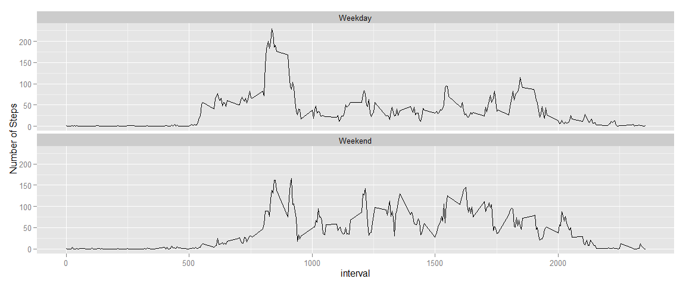

# Reproducible Research: Peer Assessment 1


## Loading and preprocessing the data

```r
options(scipen=1, digits=2)
setwd("~/GitHub/RepData_PeerAssessment1")
unzip("activity.zip")
activity <- read.csv("activity.csv")
```

## What is mean total number of steps taken per day?
Rows with missing values are ignored. For example, 1 Oct 2012 and 8 Oct 2012 are not used to calculate the median as there are no valid data on those days.

The following shows a histogram of the total number of steps taken.

```r
library(dplyr)
```

```
## 
## Attaching package: 'dplyr'
## 
## The following object is masked from 'package:stats':
## 
##     filter
## 
## The following objects are masked from 'package:base':
## 
##     intersect, setdiff, setequal, union
```

```r
library(ggplot2)
completeActivity <- activity[complete.cases(activity),]
stepsByDate <- tbl_df(completeActivity) %>% 
              group_by(date) %>% 
              summarise(dailySteps = sum(steps))
qplot(dailySteps, data=stepsByDate, binwidth=500, xlab="No. of steps")
```

 

```r
meanSteps <- mean(stepsByDate[[2]])
medianSteps <- median(stepsByDate[[2]])
```

The mean and median number of steps taken are 10766.19 and 10765 respectively.


## What is the average daily activity pattern?

```r
stepsByInterval <- tbl_df(activity) %>% 
              group_by(interval) %>% 
              summarise(meanSteps = mean(steps, na.rm = TRUE))
plot(stepsByInterval$interval, stepsByInterval$meanSteps, type="l", xlab="Interval", ylab="Average Steps", main="Average number of steps for each interval across all days")
```

 

```r
maxIntervalSteps <- filter(stepsByInterval, meanSteps==max(stepsByInterval$meanSteps))
```

The interval 835 has the maximum number of steps (206.17) on average across all days.

## Imputing missing values

```r
naRows <- nrow(filter(activity, is.na(steps)))
```

1. The total number of missing values in the dataset is 2304.


```r
filledActivity <- activity
filledActivity <- left_join(filledActivity, stepsByInterval)
```

```
## Joining by: "interval"
```

```r
for (i in 1:nrow(filledActivity)){
  if (is.na(filledActivity[i,"steps"])){
    filledActivity[i,"steps"] = filledActivity[i,"meanSteps"]
  }
}
```

2. & 3. The strategy to fill in the missing values is to use the average steps for the interval across all days.

4. A histogram of the total number of steps taken each day based on the new activity data

```r
stepsByDate <- tbl_df(filledActivity) %>% 
              group_by(date) %>% 
              summarise(dailySteps = sum(steps))
qplot(dailySteps, data=stepsByDate, binwidth=500, xlab="No. of steps")
```

 

```r
filledMeanSteps <- mean(stepsByDate[[2]])
filledMedianSteps <- median(stepsByDate[[2]])
```

The mean and median number of steps taken based on the new activity data are 10766.19 and 10766.19 respectively. This compares to a mean of 10766.19 and a median of 10765 of the original dataset.

The mean has not changed. However, the median has changed due to the additional data available for days which have no data at all.

## Are there differences in activity patterns between weekdays and weekends?


```r
filledActivity$date <- as.POSIXct(strptime(filledActivity$date, "%Y-%m-%d"))

filledActivity <- mutate(filledActivity, dayType = ifelse(weekdays(date)=="Saturday" | weekdays(date)=="Sunday", "Weekend","Weekday"))

filledActivity$dayType <- as.factor(filledActivity$dayType)

meanStepsByDayTypeInterval <- tbl_df(filledActivity) %>% 
              group_by(dayType,interval) %>% 
              summarise(meanSteps = mean(steps))

ggplot(meanStepsByDayTypeInterval, aes(interval,meanSteps)) + geom_line() + facet_wrap(~dayType, ncol=1) + ylab("Number of Steps")
```

 
